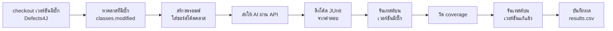

# AI-Assisted Unit Test Generation on Defects4J

ส่วนหนึ่งของโปรเจกต์รายวิชา **CP353201 Software Quality Assurance (ภาคการศึกษา 1/2569)**

โฟลเดอร์นี้เป็นส่วน **AI-Assisted Testing**: ใช้ Generative AI สร้าง unit test (JUnit 4) ให้คลาสที่มีบั๊กใน [Defects4J](https://github.com/rjust/defects4j) แล้ววัด **code coverage** และ **fault detection** แบบอัตโนมัติ เพื่อนำไปเปรียบเทียบกับอัลกอริทึมสร้างเทสต์อัตโนมัติ


---

## สารบัญ

1. [ภาพรวมการทำงาน](#1-ภาพรวมการทำงาน)
2. [โครงสร้างโฟลเดอร์](#2-โครงสร้างโฟลเดอร์)
3. [สิ่งที่ต้องมี](#3-สิ่งที่ต้องมี)
4. [ติดตั้งเครื่องมือ](#4-ติดตั้งเครื่องมือ)
5. [เตรียมโปรเจกต์และ API key](#5-เตรียมโปรเจกต์และ-api-key)
6. [ตั้งค่าสคริปต์](#6-ตั้งค่าสคริปต์)
7. [รันการทดลอง](#7-รันการทดลอง)
8. [ผลลัพธ์และการอ่านผล](#8-ผลลัพธ์และการอ่านผล)
9. [โหมด manual (ใช้หน้าแชทแทน API)](#9-โหมด-manual-ใช้หน้าแชทแทน-api)
10. [คำสั่งทั้งหมด](#10-คำสั่งทั้งหมด)
11. [ข้อจำกัดที่ทราบ](#11-ข้อจำกัดที่ทราบ)
12. [แก้ปัญหา](#12-แก้ปัญหา)

---

## 1. ภาพรวมการทำงาน

สคริปต์ `run_ai_tests.py` ทำงานต่อบั๊ก 1 ตัวดังนี้



- **จับบั๊กได้ (kills bug)** หมายถึงมีเทสต์ที่ **fail บนเวอร์ชันที่มีบั๊ก** แต่ **pass บนเวอร์ชันที่แก้แล้ว**
- AI ไม่ได้รับข้อมูลว่าบั๊กอยู่ตรงไหน ได้รับเฉพาะซอร์สโค้ดของคลาส
- ใช้ `temperature = 0` และรันบั๊กละ 1 รอบ
- สคริปต์หยุดแล้วรันใหม่ได้ตลอด จะทำต่อจากจุดเดิม และใช้คำตอบของ AI ที่ได้แล้วซ้ำ ไม่เรียก API ใหม่

---

## 2. โครงสร้างโฟลเดอร์

```
AI_Testing/
├── README.md
├── run_ai_tests.py          สคริปต์หลัก
├── bugs.txt                 รายชื่อบั๊กที่จะรัน (<Project> <BugId>)
├── .gitignore
├── api_keys.txt             List API key
└── AI_Results/              ผลลัพธ์ (สคริปต์สร้างให้)
    ├── config_<Model>.json      ค่าที่ใช้รันของแต่ละโมเดล
    ├── Prompt/
    │   ├── prompt_template.txt  แม่แบบพรอมพ์
    │   └── <Project>/<Bug>/     พรอมพ์ที่ส่งจริง
    ├── TestCode/
    │   └── <Project>/<Bug>/<Model>/<package>/*Test.java
    └── Result/
        ├── results.csv              ผลรายคลาส (ไฟล์หลัก)
        ├── summary_by_project.csv   สรุปรายโมเดลและรายโปรเจกต์
        ├── token_usage.csv          token ที่ใช้ต่อคำขอ
        ├── failed.csv               บั๊กที่ error และยังไม่มีผล
        ├── errors.csv               ประวัติ error ทุกครั้ง
        └── <Project>/<Bug>/<Model>/ คำตอบดิบของ AI และ log การรัน
```

---

## 3. สิ่งที่ต้องมี

| สิ่งที่ต้องมี | หมายเหตุ |
|---|---|
| Linux, macOS หรือ Windows + WSL2 (Ubuntu) | Defects4J ไม่รองรับ Windows โดยตรง |
| Java **11** | Defects4J ทดสอบบั๊กทุกตัวด้วย Java 11 |
| Git, Subversion, Perl, cpanminus | ใช้ติดตั้ง Defects4J |
| Python 3.8 ขึ้นไป | ใช้แค่ไลบรารีมาตรฐาน ไม่ต้อง `pip install` |
| พื้นที่ว่างอย่างน้อย 10 GB | สำหรับ Defects4J และไฟล์ชั่วคราว |
| API key ของ KKU IntelSphere | สร้างที่ gen.ai.kku.ac.th |

---

## 4. ติดตั้งเครื่องมือ

### 4.1 ติดตั้ง WSL (เฉพาะ Windows)

เปิด **Terminal (Admin)** แล้วรัน

```powershell
wsl --install
```

รีสตาร์ทเครื่อง ตั้ง username และ password ของ Ubuntu แล้วรันคำสั่งที่เหลือทั้งหมดในหน้าต่าง Ubuntu

### 4.2 ติดตั้งโปรแกรมพื้นฐาน (Ubuntu)

```bash
sudo apt update
sudo apt install -y openjdk-11-jdk git subversion perl cpanminus build-essential unzip curl python3
```

ตรวจเวอร์ชัน Java ต้องเป็น 11

```bash
java -version
# ถ้าไม่ใช่ 11 ให้เลือกด้วย:
sudo update-alternatives --config java
```

> **macOS:** `brew install openjdk@11 git svn cpanminus python`

### 4.3 ติดตั้ง Defects4J

```bash
cd ~
git clone https://github.com/rjust/defects4j
cd defects4j
sudo cpanm --installdeps .
./init.sh
echo 'export PATH=$PATH:$HOME/defects4j/framework/bin' >> ~/.bashrc
source ~/.bashrc
```

### 4.4 ตรวจการติดตั้ง

```bash
defects4j info -p Lang
defects4j checkout -p Lang -v 1b -w /tmp/lang_1b
cd /tmp/lang_1b && defects4j test
```

ต้องเห็น `Failing tests: 1` หรือมากกว่า (เทสต์ของผู้พัฒนาจับบั๊กได้) จากนั้นลบโฟลเดอร์ทดสอบ

```bash
cd ~ && rm -rf /tmp/lang_1b
```

---

## 5. เตรียมโปรเจกต์และ API key

### 5.1 Clone repository

```bash
cd ~
git clone https://github.com/<user>/<repo>.git
cd <repo>/AI_Testing
```

### 5.2 สร้าง API key

1. เข้า [gen.ai.kku.ac.th](https://gen.ai.kku.ac.th) แล้วล็อกอินด้วยบัญชี มข.
2. ไปที่ **ตั้งค่า > API Platform** แล้วสร้าง key

### 5.3 ใส่ key ในไฟล์ `api_keys.txt`

บรรทัดละ 1 key

```text
# key ของสมาชิก 1
sk_xxxxxxxxxxxxxxxx
# key ของสมาชิก 2
sk_yyyyyyyyyyyyyyyy
```

สคริปต์ใช้ key จาก **บนลงล่าง** เมื่อ key ไหนโควต้าหมดหรือใช้ไม่ได้ จะสลับไปตัวถัดไปเอง

ถ้ามี key เดียว ใช้ environment variable แทนก็ได้

```bash
echo 'export KKU_API_KEY="sk_xxxxxxxx"' >> ~/.bashrc
source ~/.bashrc
```

### 5.4 ป้องกันไม่ให้ key หลุด

```bash
chmod 600 api_keys.txt
cat >> .gitignore <<'EOF'
api_keys.txt
.keys_state.json
work/
*.tar.bz2
__pycache__/
run.log
EOF
git status        # ต้องไม่เห็น api_keys.txt ในรายการ
```

**ห้าม** ใส่ key ในไฟล์สคริปต์ และห้ามวาง key ในแชตหรือ issue

---

## 6. ตั้งค่าสคริปต์

เปิด `run_ai_tests.py` แล้วแก้ส่วน **ตั้งค่า** ด้านบนของไฟล์

```bash
python3 run_ai_tests.py --models     # ดู ID ของโมเดลที่ใช้ได้
nano run_ai_tests.py
```

| ค่า | ความหมาย | ค่าที่ใช้ในการทดลอง |
|---|---|---|
| `PROVIDER` | `"kku"` = API มหาวิทยาลัย, `"anthropic"` = Claude API, `"manual"` = ใช้หน้าแชท | `"kku"` |
| `MODEL` | `name` = ชื่อที่แสดงในผล, `id` = ID จาก `--models` | `{"name": "Claude", "id": "claude-sonnet-5"}` |
| `WORKERS` | จำนวนบั๊กที่รันพร้อมกัน (RAM 8 GB ใช้ 2, 16 GB ใช้ 3) | `2` |
| `TEMPERATURE` | ความสุ่มของคำตอบ AI | `0` |
| `MAX_OUTPUT_TOKENS` | เพดานความยาวคำตอบ (`None` = ใช้ค่าของเซิร์ฟเวอร์) | `None` |
| `MAX_PROMPT_TOKENS` | ข้ามคลาสที่พรอมพ์ใหญ่เกิน (`None` = ไม่ข้าม) | `None` |
| `STREAM` | รับคำตอบแบบ streaming (กัน HTTP 504) | `True` |
| `WAIT_FOR_RESET` | โควต้าหมดทุก key แล้วรอข้ามวันเอง | `True` |
| `COVERAGE_METRIC` | `"line"` หรือ `"condition"` (branch) | `"line"` |
| `MAX_ATTEMPTS` | จำนวนครั้งสูงสุดที่ `--retry-failed` จะลองบั๊กเดิม | `3` |

ตรวจโควต้าของ key ทุกตัว

```bash
python3 run_ai_tests.py --quota
```

ตัวอย่างผล (key แสดงแบบย่อ ไม่แสดงเต็ม)

```text
key #1 (sk_43...hbN2)        เหลือ 99990 จาก 100000 token/วัน
key #2 (sk_9Ab...Qz81)       HTTP 401: Invalid API key
```

---

## 7. รันการทดลอง

### 7.1 สร้างรายชื่อบั๊ก

```bash
python3 run_ai_tests.py --make-bugs    # ดึงบั๊ก active ทั้งหมดจาก Defects4J ลง bugs.txt
cp bugs.txt bugs_all.txt               # เก็บสำรองไว้
```

รูปแบบของ `bugs.txt` คือบรรทัดละ 1 บั๊ก เช่น `Lang 1` บรรทัดที่ขึ้นต้นด้วย `#` จะถูกข้าม

### 7.2 ทดลองกับบั๊กเดียวก่อน

```bash
echo "Chart 1" > bugs.txt
python3 run_ai_tests.py
```

ตัวอย่างผลบนหน้าจอ

```text
[Claude] เหลือ 1 บั๊ก (เสร็จแล้ว 0) รันพร้อมกัน 2 ตัว
[key] ใช้ key #1/25 (sk_43...hbN2)
[1/1] Claude Chart-1 CategoryItemRenderer: compiled=True coverage=72.4 kills_bug=True (โควต้าเหลือ 82000)
```

ตรวจว่าใช้งานได้ถูกต้อง

```bash
cat AI_Results/Result/results.csv
find AI_Results/TestCode/Chart/1 -name "*.java" | xargs head -40
```

ไฟล์เทสต์ต้องมีโค้ดจริงและมี `@Test` และค่า `coverage` ต้องมากกว่า 0

### 7.3 รันครบทุกบั๊ก

```bash
cp bugs_all.txt bugs.txt                       # บั๊กที่ทำแล้วจะไม่ถูกรันซ้ำ
nohup python3 run_ai_tests.py > run.log 2>&1 &
```

สคริปต์รันเบื้องหลัง ปิดหน้าต่าง terminal ได้ แต่ห้ามปิดเครื่องหรือให้เครื่องเข้าโหมด Sleep

### 7.4 ติดตามความคืบหน้า

| อยากรู้ | คำสั่ง |
|---|---|
| log ล่าสุด | `tail -20 run.log` |
| ดูแบบสด (Ctrl+C เพื่อออก) | `tail -f run.log` |
| ทำเสร็จกี่แถวแล้ว | `tail -n +2 AI_Results/Result/results.csv \| wc -l` |
| ยังรันอยู่ไหม | `pgrep -f run_ai_tests.py` |
| หยุดการรัน | `pkill -f run_ai_tests.py` |
| สรุปผลระหว่างทาง | `python3 run_ai_tests.py --summary` |

### 7.5 จัดการบั๊กที่ error

บั๊กที่ error (เช่น API ล้ม หรือ checkout ไม่ได้) จะถูกเก็บใน `failed.csv` และรันปกติจะข้ามไป

```bash
python3 run_ai_tests.py --failed               # ดูรายการและสาเหตุ
python3 run_ai_tests.py --retry-failed         # ลองใหม่ทุกตัว
python3 run_ai_tests.py --retry-failed api     # ลองใหม่เฉพาะ stage ที่เลือก
```

| stage | ความหมาย |
|---|---|
| `api` | เรียก API ไม่สำเร็จหลังลองซ้ำ (เช่น 504, เน็ตหลุด) |
| `setup` | Defects4J checkout/export หรืออ่านไฟล์ซอร์สไม่สำเร็จ |
| `empty_response` | AI ตอบกลับว่าง |
| `other` | error อื่น |

ต้องการรันบั๊กใหม่ตั้งแต่เรียก AI (ลบผลเดิมของโมเดลปัจจุบัน)

```bash
python3 run_ai_tests.py --reset Chart 1
```

### 7.6 สรุปผล

```bash
python3 run_ai_tests.py --summary
```

ได้ไฟล์ `AI_Results/Result/summary_by_project.csv`

### 7.7 รันกับโมเดลอื่น

แก้ `MODEL` ในสคริปต์ แล้วรันตามขั้นตอนเดิม ผลทุกโมเดลจะรวมใน `AI_Results` โดยแยกด้วยคอลัมน์ `model` ควรรัน **ทีละโมเดล** ไม่รันพร้อมกัน

---

## 8. ผลลัพธ์และการอ่านผล

### 8.1 `results.csv` (1 แถวต่อ 1 คลาสที่มีบั๊ก)

| คอลัมน์ | ความหมาย |
|---|---|
| `model` | AI ที่สร้างเทสต์ |
| `project`, `bug_id` | โปรเจกต์และเลขบั๊กใน Defects4J |
| `class_name` | คลาสที่มีบั๊ก (คลาสที่ให้ AI เขียนเทสต์) |
| `compiled` | เทสต์คอมไพล์และรันได้บนเวอร์ชันที่มีบั๊ก |
| `coverage` | line coverage (%) ของคลาสเป้าหมาย |
| `kills_bug` | มีเทสต์ที่ fail บนเวอร์ชันมีบั๊ก แต่ pass บนเวอร์ชันแก้แล้ว |
| `buggy_failing` | จำนวนเทสต์ที่ fail บนเวอร์ชันมีบั๊ก |
| `fixed_failing` | จำนวนเทสต์ที่ fail บนเวอร์ชันแก้แล้ว (มากกว่า 0 = AI เขียน assert ผิด) |
| `error` | สาเหตุเมื่อทำไม่สำเร็จ (ว่าง = สำเร็จ) |
| `test_file` | path ของไฟล์เทสต์ |
| `prompt_chars` | ความยาวพรอมพ์ (ตัวอักษร) |

### 8.2 วิธีอ่านผลการจับบั๊ก

| buggy_failing | fixed_failing | kills_bug | ความหมาย |
|---|---|---|---|
| 1 | 0 | True | จับบั๊กได้ และไม่มีเทสต์ที่ผิด |
| 2 | 1 | True | จับบั๊กได้ แต่มีเทสต์ 1 ตัวที่ assert ผิด |
| 0 | 0 | False | เทสต์ผ่านทั้งหมด แต่จับบั๊กไม่ได้ |
| 3 | 3 | False | เทสต์ที่ fail เป็น false positive ทั้งหมด |

### 8.3 ตัวชี้วัดใน `summary_by_project.csv`

| คอลัมน์ | วิธีคิด |
|---|---|
| `compile_rate_%` | แถวที่ `compiled = True` ÷ แถวทั้งหมด |
| `bugs_killed` | จำนวนบั๊กที่มีอย่างน้อย 1 คลาส `kills_bug = True` |
| `fault_detection_rate_%` | `bugs_killed` ÷ จำนวนบั๊ก |
| `avg_line_coverage_%` | ค่าเฉลี่ย `coverage` ของแถวที่คอมไพล์ผ่าน |

### 8.4 ไฟล์อื่น

| ไฟล์ | ใช้ทำอะไร |
|---|---|
| `token_usage.csv` | token ที่ใช้ต่อคำขอ และ key ที่ใช้ (`@keyN` ในคอลัมน์ `label`) |
| `failed.csv` | บั๊กที่ยังค้าง พร้อม stage และจำนวนครั้งที่ลอง |
| `errors.csv` | ประวัติ error ทุกครั้ง |
| `Result/<Project>/<Bug>/<Model>/*.response.md` | คำตอบดิบของ AI (รวมตารางสรุปที่ AI เขียนท้ายโค้ด) |
| `Result/<Project>/<Bug>/<Model>/*.log` | log ของ `defects4j test` และ `defects4j coverage` |

---

## 9. โหมด manual (ใช้หน้าแชทแทน API)

ใช้เมื่อไม่มี API หรือโควต้าหมด ตั้ง `PROVIDER = "manual"` แล้ว

```bash
python3 run_ai_tests.py --prepare 20                # เตรียมพรอมพ์ 20 บั๊ก
python3 run_ai_tests.py --next                      # ดูว่าต้องทำไฟล์ไหน
# คัดลอกไฟล์ .prompt.txt ไปวางในหน้าแชทใหม่ แล้วคัดลอกคำตอบกลับมา
python3 run_ai_tests.py --save Lang 1 NumberUtils   # วางคำตอบ แล้วกด Enter ตามด้วย Ctrl+D
python3 run_ai_tests.py                             # รันเทสต์บั๊กที่มีคำตอบครบแล้ว
```

ผลจากโหมด manual อาจต่างจาก API เล็กน้อย เพราะหน้าแชทตั้ง temperature ไม่ได้

---

## 10. คำสั่งทั้งหมด

| คำสั่ง | ทำอะไร |
|---|---|
| `python3 run_ai_tests.py` | รันงานตาม `bugs.txt` (ทำต่อจากจุดเดิม) |
| `--make-bugs` | สร้าง `bugs.txt` จากบั๊ก active ทั้งหมด |
| `--models` | ดูรายชื่อโมเดลและ ID |
| `--quota` | ดูโควต้าของ key ทุกตัว |
| `--summary` | สรุปผลรายโมเดลและรายโปรเจกต์ |
| `--failed` | ดูบั๊กที่ error ค้างอยู่ |
| `--retry-failed [stage]` | ลองบั๊กที่ error ใหม่ |
| `--reset <Project> <Bug>` | ลบผลของบั๊กหนึ่งตัว (โมเดลปัจจุบัน) เพื่อรันใหม่ |
| `--merge <โฟลเดอร์> <ชื่อโมเดล>` | ย้ายผลจากโครงสร้างเก่าที่แยกโฟลเดอร์ตามโมเดลเข้ามารวม |
| `--prepare [N]`, `--next`, `--save <P> <B> <Class>` | ใช้ในโหมด manual |

---

## 11. ข้อจำกัดที่ทราบ

- **บั๊กที่ทดสอบคลาสเป้าหมายไม่ได้:** บางบั๊กการแก้ไขเพิ่มคลาสใหม่ หรือแก้ไฟล์ที่ไม่ใช่ Java คลาสนั้นจึงไม่มีในเวอร์ชันที่มีบั๊ก บั๊กเหล่านี้จะค้างใน `failed.csv` ด้วย stage `setup` และลองใหม่ไม่สำเร็จ ได้แก่ Codec-13, Codec-14, Closure-169 และ Jsoup-71
- **ความไม่แน่นอนของ AI:** แม้ใช้ `temperature = 0` คำตอบอาจต่างกันเล็กน้อยระหว่างรอบ และรันบั๊กละ 1 รอบ
- **Data leakage:** Defects4J เป็นชุดข้อมูลสาธารณะ AI อาจเคยเห็นโค้ดหรือบั๊กมาก่อนจากข้อมูลที่ใช้ฝึก และพรอมพ์ระบุชื่อบั๊ก (เช่น `Chart-1b`) ไว้ด้วย
- **ผลขึ้นกับพรอมพ์:** ข้อ 4 ในพรอมพ์ ("ห้ามเดา behavior ที่ไม่มีอยู่ในซอร์ส") อาจทำให้ AI เขียน assert ตามพฤติกรรมของโค้ดที่มีบั๊ก จึงจับบั๊กไม่ได้
- **คลาสขนาดใหญ่:** บางคลาส (โดยเฉพาะ Closure) ทำให้พรอมพ์ยาวมาก ใช้ token สูง และคำตอบอาจถูกตัด
- **โควต้า API:** ความเร็วในการรันครบทุกบั๊กขึ้นกับโควต้ารายวันของ key ที่มี

---

## 12. แก้ปัญหา

| อาการ | สาเหตุและวิธีแก้ |
|---|---|
| `defects4j: command not found` | รัน `source ~/.bashrc` |
| คอมไพล์ error เรื่องเวอร์ชัน Java | ต้องใช้ Java 11 ดูหัวข้อ 4.2 |
| `ไม่พบ API key` | สร้าง `api_keys.txt` หรือตั้ง `KKU_API_KEY` |
| `HTTP 401: Invalid API key` | key ผิดหรือหมดอายุ สร้างใหม่แล้วแก้ใน `api_keys.txt` |
| `HTTP 401: Invalid model` | ID ผิด ตรวจด้วย `--models` |
| `HTTP 504 Gateway Time-out` | ตรวจว่า `STREAM = True` ลด `WORKERS` หรือรันช่วงคนใช้น้อย |
| `[quota] โควต้าหมด` | ปกติ ถ้า `WAIT_FOR_RESET = True` จะรอข้ามวันเอง |
| `.. เป็นรูปแบบเก่า ให้เปลี่ยนชื่อไฟล์ก่อน` | ย้าย `results.csv` เดิมออก (เช่น `mv ... results_old.csv`) |
| `'>' not supported between 'int' and 'NoneType'` | ใช้สคริปต์เวอร์ชันเก่า ให้ใช้เวอร์ชันใน repository นี้ |
| ไฟล์เทสต์มีแค่บรรทัด `package` | ใช้สคริปต์เวอร์ชันเก่า ให้ใช้เวอร์ชันใน repository นี้แล้ว `--reset` บั๊กนั้น |
| ต้องการให้ลองทุก key ใหม่ตั้งแต่ต้น | `rm .keys_state.json` |

---

## อ้างอิง

- Defects4J: <https://github.com/rjust/defects4j>
- Defects4J documentation: <https://defects4j.org/html_doc/index.html>
- Just, R., Jalali, D., & Ernst, M. D. (2014). *Defects4J: A database of existing faults to enable controlled testing studies for Java programs.* ISSTA 2014. <https://dl.acm.org/doi/10.1145/2610384.2628055>
- KKU IntelSphere API: <https://gen.ai.kku.ac.th/docs/api>
